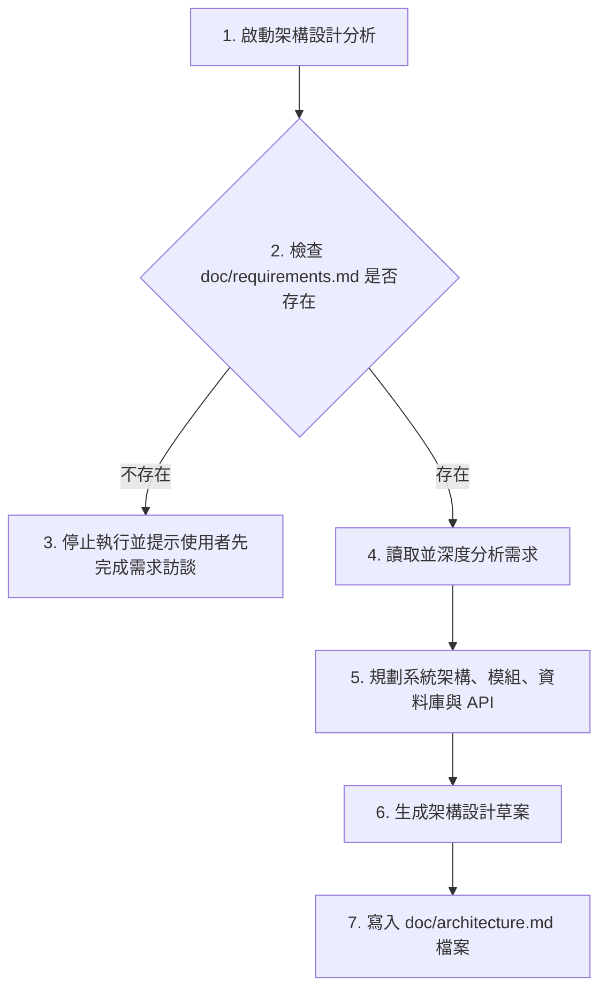
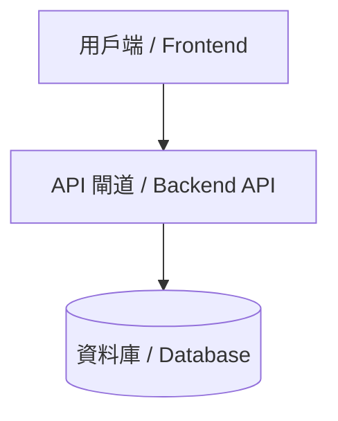
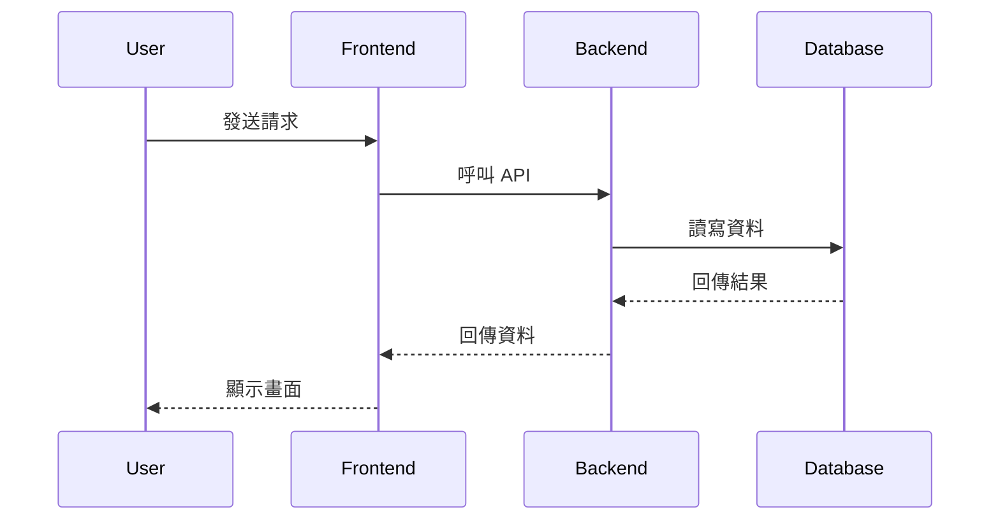
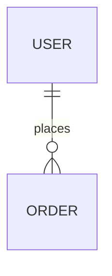

# 架構設計文件生成 Skill 指南

本 Skill 引導 AI 讀取專案中已存在的 `doc/requirements.md`，分析需求並設計系統架構，最後於 `doc/architecture.md` 產生結構完整的架構設計文件。

---

## 執行流程 (Execution Workflow)



---

## 核心行為守則 (Core Rules)

1. **防呆檢查 (Pre-flight Check)**：
   - 啟動後，**第一步必須檢查**專案根目錄下是否存在 `/doc/requirements.md`。
   - **如果不存在**，請**立即終止**架構設計流程，並向使用者輸出以下提示：
     > [!WARNING]
     > 找不到 `/doc/requirements.md` 需求規格書。請先與我進行需求訪談以建立規格書（可啟用 `requirements-interviewer` 輔助），完成後再進行架構設計。

2. **不得自行補足未確認需求 (No Guessing / Telepathy)**：
   - 嚴禁自行預設或補足任何在 `requirements.md` 中未提及、模糊或不確定的系統需求（例如：未說明的第三方串接、不確定的權限分級等）。
   - 對於任何不確定的部分，**必須將其歸類並列入「待確認事項」章節**中，不得將其作為預設架構來設計。

3. **系統架構圖規範**：
   - 系統架構圖**必須使用 Mermaid 語法**繪製（例如 `graph TD`、`graph LR` 或 C4 Model 語法），確保能夠在 Markdown 中直接被視覺化渲染。

---

## 輸出文件範本格式 (Template for /doc/architecture.md)

產出的 `/doc/architecture.md` 請採用以下標準結構：

```markdown
# [專案名稱] 架構設計文件 (System Architecture Design Document)

- **文件版本**：v1.0.0
- **建立日期**：[YYYY-MM-DD]
- **撰寫人**：AI 架構設計小助手 (architecture-designer)
- **依據需求版本**：`doc/requirements.md` v1.0.0

---

## 1. 系統架構圖 (System Architecture)
*請在此處使用 Mermaid 描述系統架構，例如前端、後端、資料庫、快取、外部服務之關聯。*



## 2. 核心模組職責 (Core Modules)
*說明系統中各核心模組/組件的職責劃分。*

| 模組名稱 | 職責說明 | 主要互動對象 |
| :--- | :--- | :--- |
| [模組 A] | [職責簡述] | [關聯模組] |
| [模組 B] | [職責簡述] | [關聯模組] |

## 3. 資料流 (Data Flows)
*說明系統中關鍵業務流程的資料流向。*



## 4. 資料庫設計建議 (Database Design)
*提出資料庫的 Table 綱要設計與關聯建議。*

### 4.1 實體關係圖 (ER Diagram) - 選用


### 4.2 資料表結構 (Schema)

#### 表名：`users` (使用者資料表)
| 欄位名稱 | 資料類型 | 屬性限制 | 說明 |
| :--- | :--- | :--- | :--- |
| id | INT / UUID | PK, Auto Increment | 使用者唯一識別碼 |
| email | VARCHAR(255) | Unique, Not Null | 電子信箱 (登入帳號) |

---

## 5. API 設計建議 (API Design)
*針對核心功能提供 RESTful API 或 GraphQL 端點設計建議。*

### 5.1 [模組名稱] API
- **取得資料清單**
  - **Method / Path**：`GET /api/v1/resources`
  - **Request Query Parameters**：
    - `page` (optional): 頁碼
  - **Response (200 OK)**：
    ```json
    {
      "success": true,
      "data": []
    }
    ```

---

## 6. 技術選型 (Technology Stack)
*評估並推薦適合此專案的技術，並說明理由。*
- **前端 (Frontend)**：[如 React / Next.js / Vue] - 推薦理由
- **後端 (Backend)**：[如 Node.js / Go / Python] - 推薦理由
- **資料庫 (Database)**：[如 PostgreSQL / MySQL / MongoDB] - 推薦理由
- **其他基礎設施**：[如 Redis, RabbitMQ] - 推薦理由

## 7. 安全性設計 (Security Design)
- **身份驗證與授權**：[如 JWT, OAuth2]
- **資料保護**：[如 HTTPS, 敏感欄位加密 (AES-256)]
- **防禦機制**：[如 CORS 設定、SQL Injection 防禦、Rate Limiting]

## 8. 部署方式 (Deployment Strategy)
- **基礎設施**：[如 Docker 容器化、雲端託管 AWS/GCP、或 Vercel]
- **CI/CD**：[如 GitHub Actions / GitLab CI]

## 9. 待確認事項 (Items to be Confirmed)
> [!IMPORTANT]
> 以下為目前需求中未明確定義、存在模糊或需進一步向使用者確認的事項：
> 1. [未確認事項一] - 影響架構中 [模組/功能] 的設計。
> 2. [未確認事項二] - 影響技術選型或資料庫欄位設計。
```
