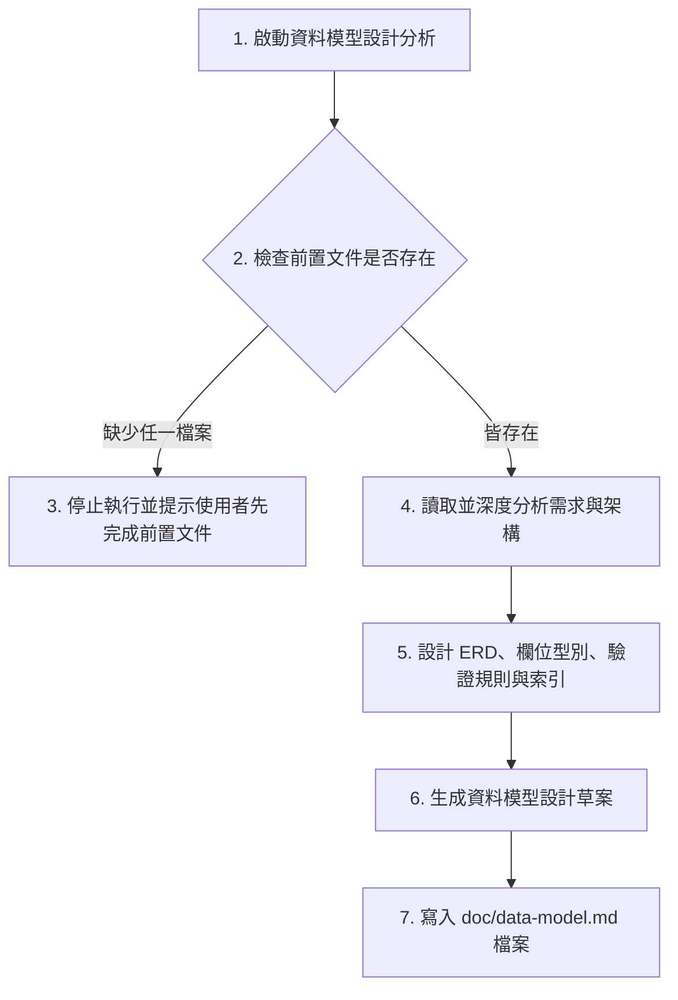
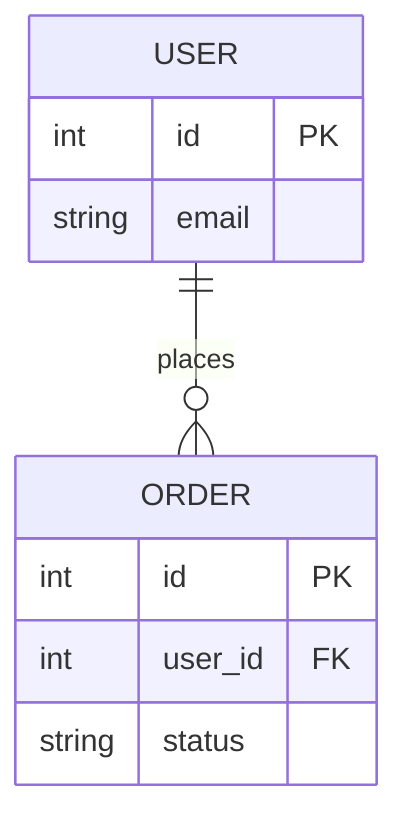

# 資料模型設計文件生成 Skill 指南

本 Skill 引導 AI 讀取專案中已存在的 `doc/requirements.md` 與 `doc/architecture.md`，分析需求規格與架構設計，進而規劃出結構完整的資料模型設計文件，並寫入至 `doc/data-model.md`。

---

## 執行流程 (Execution Workflow)



---

## 核心行為守則 (Core Rules)

1. **防呆檢查 (Pre-flight Check)**：
   - 啟動後，**第一步必須檢查**專案根目錄下是否存在以下兩個檔案：
     - `/doc/requirements.md`
     - `/doc/architecture.md`
   - **若缺少任一檔案**，請**立即終止**流程，並向使用者輸出以下提示：
     > [!WARNING]
     > 找不到前置文件 `/doc/requirements.md` 或 `/doc/architecture.md`。請先完成需求訪談與架構設計，確保兩份文件皆已生成，再行執行資料模型設計。

2. **不得自行假設業務規則 (No Assumptions on Business Rules)**：
   - 嚴禁自行假設或臆測任何未在 `requirements.md` 或 `architecture.md` 中定義的業務規則（例如：訂單狀態機的流轉邏輯、特定的金額折抵演算法等）。
   - 任何推測、不確定或有疑慮的業務規則，**必須列入「待確認事項」章節**中，不得直接作為確定規則寫入資料模型中。

3. **通用關聯式資料庫概念與 SQL 型別**：
   - 資料模型應以通用的關聯式資料庫概念進行描述（包含主鍵 PK、外鍵 FK、一對多 1:N 等關聯）。
   - 在定義欄位時，需提供**通用邏輯型別**（如 String, Integer, DateTime），並同時提供**對應的 SQL 資料型別建議**（如 `VARCHAR(255)`, `INT`, `TIMESTAMP`）。

4. **實體關係圖規範**：
   - 實體關係圖**必須使用 Mermaid erDiagram 語法**繪製，以利在 Markdown 中直接被視覺化渲染。

---

## 輸出文件範本格式 (Template for /doc/data-model.md)

產出的 `/doc/data-model.md` 請採用以下標準結構：

```markdown
# [專案名稱] 資料模型設計文件 (Data Model Design Document)

- **文件版本**：v1.0.0
- **建立日期**：[YYYY-MM-DD]
- **撰寫人**：AI 資料模型設計小助手 (data-modeler)
- **依據需求版本**：`doc/requirements.md` v1.0.0
- **依據架構版本**：`doc/architecture.md` v1.0.0

---

## 1. 實體關係圖 (Entity Relationship Diagram)
*請在此處使用 Mermaid 描述資料庫的 ER 圖。*



## 2. 核心實體清單 (Core Entities)
*列出系統中所有核心資料表/實體及其簡要說明。*

| 實體/資料表名稱 | 邏輯名稱 | 描述說明 | 主鍵 (PK) |
| :--- | :--- | :--- | :--- |
| `users` | 使用者 | 儲存帳號與基本資訊 | `id` |
| `orders` | 訂單 | 儲存交易明細 | `id` |

## 3. 實體詳細欄位與資料型別 (Entity Fields & Data Types)

### 3.1 實體：`users` (使用者表)
- **說明**：[實體說明]

| 欄位名稱 (Physical) | 欄位名稱 (Logical) | 邏輯型別 | SQL 型別建議 | 屬性限制 | 說明 |
| :--- | :--- | :--- | :--- | :--- | :--- |
| `id` | 使用者 ID | Integer | `INT` / `BIGINT` | PK, Auto Inc, Not Null | 唯一識別碼 |
| `email` | 電子信箱 | String | `VARCHAR(255)` | Unique, Not Null | 登入帳號 |
| `created_at` | 建立時間 | DateTime | `TIMESTAMP` | Not Null, Default NOW | 資料建立時間 |

### 3.2 實體：`orders` (訂單表)
- **說明**：[實體說明]

| 欄位名稱 (Physical) | 欄位名稱 (Logical) | 邏輯型別 | SQL 型別建議 | 屬性限制 | 說明 |
| :--- | :--- | :--- | :--- | :--- | :--- |
| `id` | 訂單 ID | Integer | `INT` / `BIGINT` | PK, Auto Inc, Not Null | 唯一識別碼 |
| `user_id` | 使用者 ID | Integer | `INT` / `BIGINT` | FK (users.id), Not Null | 關聯使用者 |
| `status` | 訂單狀態 | String | `VARCHAR(50)` | Not Null | 訂單當前狀態 |

---

## 4. 資料驗證規則 (Data Validation Rules)
*定義各欄位在寫入或更新時的商業驗證邏輯與長度/格式限制。*
- **[實體名稱/欄位名稱]**：
  - 格式限制：[例如：電子信箱格式正則表達式]
  - 值域限制：[例如：狀態欄位僅允許 'pending', 'paid', 'shipped', 'cancelled']
  - 長度限制：[例如：密碼雜湊長度固定為 60 字元]

## 5. 索引建議 (Index Recommendations)
*為優化查詢效能而提出的單一欄位或複合索引建議。*

| 資料表 | 索引名稱 | 索引欄位 | 索引類型 | 建立理由/主要查詢場景 |
| :--- | :--- | :--- | :--- | :--- |
| `users` | `idx_users_email` | `email` | UNIQUE | 用於登入時的高速帳號比對 |
| `orders` | `idx_orders_user_status` | `user_id`, `status` | COMPOSITE | 用於查詢某會員在特定狀態下的訂單 |

## 6. 資料生命週期 (Data Lifecycle)
*說明資料的保存、封存與刪除原則。*
- **虛擬刪除 (Soft Delete)**：哪些資料表應採用虛擬刪除（如 `deleted_at` 欄位）以利保留歷史紀錄？
- **歷史封存 (Archiving)**：例如：超過 1 年的完成訂單，是否需定期搬移至封存資料表（如 `orders_archive`）以維持主表效能？
- **資料保留政策**：臨時性的 Log 或 Token 資料表的自動清理機制。

## 7. 敏感資料處理方式 (Sensitive Data Handling)
*定義個資法規或資安要求的敏感資料防護措施。*
- **密碼安全**：使用者密碼必須經過單向雜湊（如 BCrypt 或 Argon2）後始得存入。
- **個人識別資訊 (PII)**：如身分證字號、手機號碼，是否需要進行遮罩（Masking）或對稱加密（AES-256）儲存？

## 8. 待確認事項 (Items to be Confirmed)
> [!IMPORTANT]
> 以下為業務規則中未定義、模糊或目前僅為 AI 推測之部分，請專案管理員 (PM) 或使用者確認：
> 1. [未確認事項一] - 影響 `[欄位/表名]` 的資料型別或關係設計。
> 2. [未確認事項二] - 影響資料驗證規則或狀態欄位的值域定義。
```
