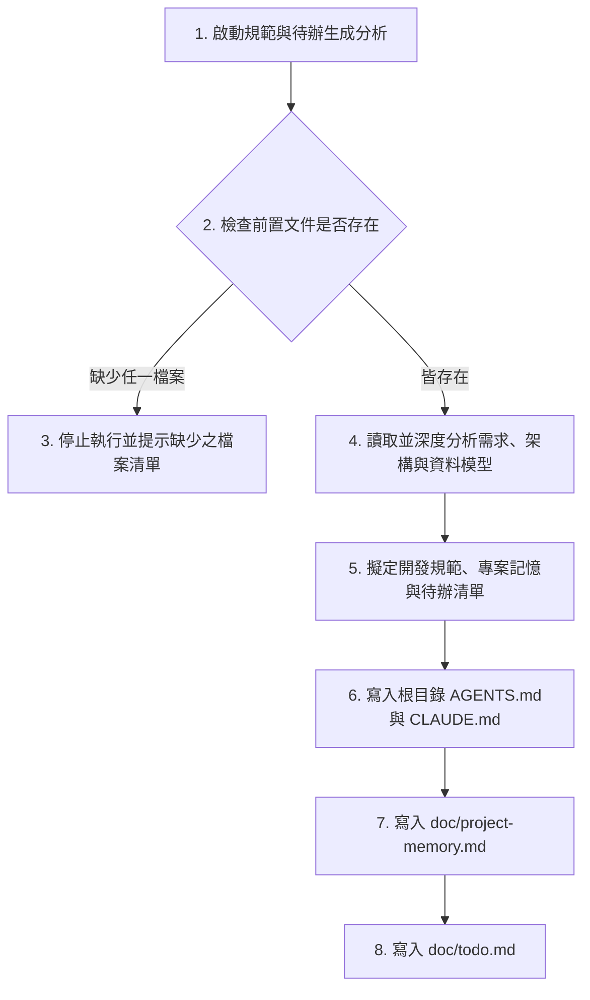

# 專案規範與待辦清單生成 Skill 指南

本 Skill 引導 AI 讀取專案中已存在的 `doc/requirements.md`、`doc/architecture.md` 與 `doc/data-model.md`，統整需求、架構與資料庫設計，進而產生專案規範文件與待辦任務清單。

---

## 執行流程 (Execution Workflow)



---

## 核心行為守則 (Core Rules)

1. **嚴格防呆檢查 (Pre-flight Check)**：
   - 啟動後，**第一步必須檢查**專案根目錄下是否存在以下三個檔案：
     - `/doc/requirements.md`
     - `/doc/architecture.md`
     - `/doc/data-model.md`
   - **若有任何一個檔案不存在**，請**立即終止**流程，並向使用者精確輸出缺少哪些檔案的警告：
     > [!WARNING]
     > 缺少前置文件，無法生成規範與待辦清單。
     > 缺少的檔案：[列出缺少的檔案，如：/doc/data-model.md]

2. **開發技術棧硬性限制**：
   - **後端 (Backend)**：FastAPI
   - **前端 (Frontend)**：React
   - **本地開發資料庫**：SQLite
   - **正式環境部署平台**：Render.com
   - **正式環境資料庫**：Render PostgreSQL

3. **資安規範與環境變數**：
   - 嚴禁在代碼中硬編碼（Hardcode）或提交至 Git 任何機密資訊（如 API Keys、密碼、Token、資料庫連線字串等）。
   - 必須規範使用環境變數（Environment Variables）管理敏感設定，並提供 `.env.example` 給開發人員參考。
   - 必須強制要求將 `.env` 寫入 `.gitignore` 中。

4. **禁止將未確認需求列為可開發項目**：
   - 在產生 `/doc/todo.md` 時，若前置文件（如 `requirements.md` 的「排除範圍」或 `architecture.md`/`data-model.md` 的「待確認事項」）中有尚未確認的需求，**絕對不能**將其歸類為可直接開發（Todo）的項目，必須標記為「待確認/掛起」狀態，以防開發代理（Agent）或人工作業時發生錯誤。

5. **語言規範**：
   - 產生的所有規範文件、待辦事項等內容，皆必須使用**繁體中文 (Traditional Chinese)** 撰寫。

---

## 輸出文件範本格式與要求

請分析前置檔案並以下列格式產生對應檔案：

### 1. 專案根目錄：[AGENTS.md](file:///c:/Users/CC/OneDrive/Desktop/delivery/AGENTS.md)
作為 AI 工具與人類開發者共同遵守的開發與協作核心規範：
```markdown
# 專案 AI 協作與開發規範 (AGENTS.md)

- **適用對象**：AI 開發代理 (Agents)、人類開發者
- **更新日期**：[YYYY-MM-DD]

---

## 1. 專案技術棧 (Technology Stack)
- **後端**：FastAPI (Python)
- **前端**：React (JavaScript/TypeScript)
- **開發資料庫 (Local)**：SQLite
- **生產環境資料庫 (Production)**：Render PostgreSQL
- **部署平台**：Render.com

## 2. 資安與憑證規範 (Security & Credentials)
> [!CAUTION]
> 嚴禁將任何金鑰、密碼、Token、資料庫連線字串硬編碼於代碼中，或提交至 Git 倉庫！
- **環境變數管理**：所有敏感設定必須由環境變數讀取。
- **設定檔說明**：請參考專案根目錄的 `.env.example`。
- **Git 排除**：本地的 `.env` 檔案必須加入 `.gitignore` 中，防止意外提交。

## 3. Git 提交規範 (Commit Guidelines)
- 提交訊息格式：`[Type] 簡短描述` (例如：`feat: 實作使用者登入`, `fix: 修復 API 驗證錯誤`)。
- 程式提交前必須執行語法檢查與格式化。

## 4. AI 協作指引 (AI Agent Guidelines)
- 進行任何修改前，必須先閱讀 `doc/project-memory.md` 與 `doc/todo.md`。
- 遇未確認之需求，必須立刻向使用者提問，禁止自行通靈臆測。
```

---

### 2. 專案根目錄：[CLAUDE.md](file:///c:/Users/CC/OneDrive/Desktop/delivery/CLAUDE.md)
為 Claude 提供相容的規範指引，內容應指向或同步 `AGENTS.md`：
```markdown
# Claude 協作規範指引 (CLAUDE.md)

本專案之 AI 協作與開發規範統一記錄於根目錄之 `AGENTS.md`。
請 Claude 在開始進行任何代碼修改、重構或測試前，務必詳閱並遵守以下檔案中的規定：

- **開發規範核心**：[AGENTS.md](AGENTS.md)
- **專案長期記憶與決策**：[doc/project-memory.md](doc/project-memory.md)
- **當前開發任務與待辦**：[doc/todo.md](doc/todo.md)
```

---

### 3. [doc/project-memory.md](file:///c:/Users/CC/OneDrive/Desktop/delivery/doc/project-memory.md)
用於記錄長期有效的專案決策、技術選型、重要限制與已確認的業務規則。**必須包含更新規則**：
```markdown
# 專案記憶與長期決策 (Project Memory)

本文件用於記錄專案中長期有效的技術決策、業務規則與架構限制。

---

## 1. 文件更新規則 (Memory Update Rules)
> [!IMPORTANT]
> - **更新時機**：僅在「確認新技術/業務決策」、「修改既有決策」或「發現重要架構限制」時更新本文件。
> - **紀錄格式**：每次更新必須在下方的「變更紀錄」中留下紀錄，包含：更新日期、異動原因、以及受影響的範圍。

## 2. 變更紀錄 (Changelog)

| 異動日期 | 異動內容與原因 | 影響範圍 | 經辦人 |
| :--- | :--- | :--- | :--- |
| 2026-07-16 | 初始專案規範建立（FastAPI, React, SQLite, Render） | 全專案 | AI spec-coordinator |

## 3. 技術選型與決策 (Technical Decisions)
*詳細記錄為何選用此技術及相關限制。*
- **後端 FastAPI**：基於高性能、自動生成 OpenAPI 文件而選用。
- **本地 SQLite**：易於本地開發且免去繁雜設定；生產環境則自動切換至 Render PostgreSQL。

## 4. 已確認的業務規則 (Confirmed Business Rules)
*列出從需求規格書中已完全確認、不需再討論的業務邏輯。*

## 5. 架構限制 (Architectural Constraints)
- Render.com 免費方案之容器可能會有冷啟動延遲，設計 API 時需考量逾時處理。
```

---

### 4. [doc/todo.md](file:///c:/Users/CC/OneDrive/Desktop/delivery/doc/todo.md)
列出待開發需求、相依性、驗收條件與優先級，且**不得**將未確認需求列為可直接開發項目：
```markdown
# 專案開發待辦清單 (Project Todo List)

本清單列出專案所有待開發功能、相依關係與驗收條件。請依優先級由高至低逐步實作。

---

## 1. 待開發任務 (Todo List)

### [P0] 任務名稱
- **狀態**：`[ ] Todo` (可為 `[ ] Todo` / `[/] In Progress` / `[x] Done`)
- **相依關係**：無 / 關聯任務 ID
- **驗收條件**：
  - [ ] 條件 1...
  - [ ] 條件 2...

---

## 2. 待確認/掛起之需求 (Unconfirmed & Blocked Items)
> [!WARNING]
> 以下項目由於需求尚未明朗或缺乏具體業務規則，**嚴禁在此時進行代碼實作**。需等 PM/使用者確認後，移至上方「待開發任務」方可執行。
- **[待確認功能 A]**：缺少 [具體資訊]，如 [欄位定義/操作流程]。
```
