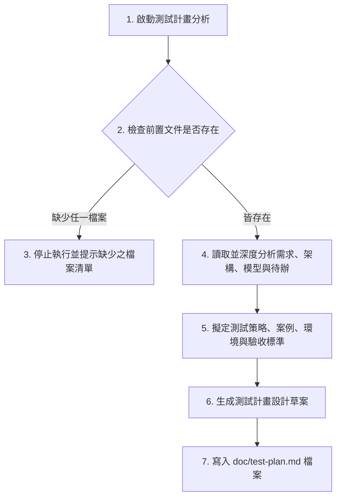

# 測試計畫規格文件生成 Skill 指南

本 Skill 引導 AI 讀取專案中已存在的 `doc/requirements.md`、`doc/architecture.md`、`doc/data-model.md` 與 `doc/todo.md`，深度分析系統的功能需求、架構限制、資料庫設計與開發任務，進而編製一份結構完整、覆蓋全面的測試計畫文件，並寫入至 `doc/test-plan.md`。

---

## 執行流程 (Execution Workflow)



---

## 核心行為守則 (Core Rules)

1. **嚴格防呆檢查 (Pre-flight Check)**：
   - 啟動後，**第一步必須檢查**專案根目錄下是否存在以下四個檔案：
     - `/doc/requirements.md`
     - `/doc/architecture.md`
     - `/doc/data-model.md`
     - `/doc/todo.md`
   - **若有任何一個檔案不存在**，請**立即終止**流程，並精確指出缺少了哪些檔案的警告：
     > [!WARNING]
     > 缺少前置文件，無法編製測試計畫。
     > 缺少的檔案：[列出缺少的檔案，如：/doc/todo.md]

2. **不得自行補足未確認需求 (No Guesswork)**：
   - 對於需求規格、系統架構、業務邏輯及資料欄位中任何不確定、模糊或標示為「待確認」的部分，**絕對不得自行假设或補足**。
   - 任何推測、不確定或有疑慮的測試情境，**必須列入「待確認事項」章節**中，不可列為合格的測試規格。

3. **需求與待辦事項的追溯性 (Traceability)**：
   - 設計的測試案例必須能對應回 `requirements.md` 中的功能需求，以及 `todo.md` 中的任務 ID。
   - 測試案例必須**依據需求優先級（P0, P1 等）排序**，確保核心功能（P0）優先測試。

4. **語言規範**：
   - 產生的所有測試計畫文件、測試步驟、驗收標準等內容，皆必須使用**繁體中文 (Traditional Chinese)** 撰寫。

---

## 輸出文件範本格式 (Template for /doc/test-plan.md)

產出的 `/doc/test-plan.md` 請採用以下標準結構：

```markdown
# [專案名稱] 測試計畫與規格文件 (Test Plan & Specification Document)

- **文件版本**：v1.0.0
- **建立日期**：[YYYY-MM-DD]
- **撰寫人**：AI 測試規劃小助手 (test-planner)
- **依據需求版本**：`doc/requirements.md` v1.0.0
- **依據架構版本**：`doc/architecture.md` v1.0.0
- **依據模型版本**：`doc/data-model.md` v1.0.0
- **依據待辦版本**：`doc/todo.md` v1.0.0

---

## 1. 測試目標與範圍 (Objectives & Scope)
- **測試目標**：[簡述測試活動的核心目的，例如確保軟體品質、驗證系統穩定性]
- **測試範圍 (In Scope)**：[列出包含的模組與功能，需對應需求規格]
- **不在測試範圍內的項目 (Out of Scope)**：[列出不進行測試的項目，如非本期開發之第三方模組]

## 2. 測試策略 (Testing Strategy)
- **單元測試 (Unit Test)**：對後端 FastAPI 邏輯函數及前端 React 輔助函數進行基礎邏輯測試。
- **整合測試 (Integration Test)**：測試各模組之間的接口呼叫與資料整合。
- **API 測試 (API Test)**：針對 API 端點進行功能性與狀態碼測試。
- **前端元件測試 (Component Test)**：測試 React 元件的渲染與本地 UI 狀態邏輯。
- **端對端測試 (E2E Test)**：模擬真實使用者在瀏覽器上的操作路徑。
- **手動驗收測試 (UAT)**：人工比對業務規格書，確保功能完全符合使用者期望。

## 3. 測試環境與測試資料規則 (Test Environment & Data Rules)
- **本地開發測試環境 (Local)**：
  - 資料庫：SQLite (唯讀、寫入、隔離測試)
  - 資料規則：本地開發隨機測試資料，使用 SQLite 特性維持測試前後的資料乾淨。
- **正式/預備環境 (Production/Staging)**：
  - 資料庫：Render PostgreSQL
  - 資料規則：禁止在生產環境使用髒資料；整合測試須於測試用 PostgreSQL Schema 執行，測試完畢須還原。

---

## 4. 測試案例 (Test Cases)
*所有主要測試案例必須以表格呈現，且依需求優先級（P0, P1...）排序，並追溯至需求或待辦事項。*

| 案例編號 | 追溯需求/待辦 ID | 優先級 | 前置條件 | 測試步驟 | 輸入資料 | 預期結果 | 驗收標準 (Acceptance Criteria) |
| :--- | :--- | :--- | :--- | :--- | :--- | :--- | :--- |
| TC-001 | REQ-001 / TODO-1 | P0 | 無 | 1. 進入註冊頁面<br>2. 輸入資料並送出 | email, password | 顯示註冊成功，跳轉首頁 | 資料寫入資料庫，密碼已 Hash 儲存 |

---

## 5. FastAPI 後端 API 測試重點 (FastAPI Backend Testing)
- **成功情境 (Success, 200/201)**：驗證正常請求下，API 格式、欄位、資料正確性。
- **欄位驗證失敗 (Validation Error, 422)**：驗證輸入資料格式錯誤（如 email 格式不符、必填欄位缺失）時，Pydantic 是否正確攔截並回傳 422。
- **未授權情境 (Unauthorized, 401/403)**：驗證未攜帶 Token 或 Token 逾期時，API 是否拒絕存取並回傳 401。
- **找不到資源 (Not Found, 404)**：驗證請求不存在的 ID 時，系統是否回傳 404 及正確錯誤訊息。
- **伺服器內部錯誤 (Server Error, 500)**：模擬資料庫斷線或程式未預期異常時，系統是否能優雅降級回傳 500，且不洩露代碼堆疊訊息。

## 6. React 前端測試重點 (React Frontend Testing)
- **畫面呈現 (Rendering)**：驗證元件於不同解析度下之排版（RWD）、各按鈕與輸入框是否正常顯示。
- **使用者互動 (Interactions)**：驗證按鈕點擊、表單輸入、下拉選單切換等互動功能。
- **表單驗證 (Form Validation)**：驗證前端防呆限制，如密碼強度不足、空白欄位提交時的即時錯誤提示。
- **載入與錯誤狀態 (Loading/Error States)**：驗證 API 載入中（顯示 Skeleton / Spinner）與呼叫失敗時的錯誤提示畫面（Toast / Banner）。
- **API 串接 (API Integration)**：驗證前後端跨域 (CORS) 連線正常，資料送出與接收格式正確。

## 7. 資料庫測試重點 (Database Testing)
- **欄位限制 (Field Constraints)**：驗證 `NOT NULL`、`UNIQUE`、長度上限及資料型別限制。
- **關聯完整性 (Relational Integrity)**：驗證外鍵限制 (FK)，例如刪除使用者時，其相關訂單應如何連動（Cascade 或 Restrict）。
- **資料驗證 (Data Validation)**：驗證資料庫觸發器（若有）或約束條件。
- **遷移與索引 (Migration & Index)**：驗證 Migration 腳本可正常 rollback；使用 `EXPLAIN` 驗證查詢時是否有正確走到索引 (Index Scan)。

## 8. 安全性測試 (Security Testing)
- **機密防護**：確保 API Key、資料庫連線密碼未提交至 Git，亦未硬編碼於 React 前端代碼或呈現在瀏覽器主控台 (Console)。
- **驗證與授權 (Auth & Authz)**：驗證越權存取（如 A 使用者嘗試讀取 B 使用者的資料）會被後端拒絕。
- **輸入過濾 (Sanitization)**：驗證 SQL Injection、XSS (跨網站指令碼) 防禦機制，確保輸入框中的特殊字元會被安全過濾或轉義。

## 9. 缺陷回報格式與測試完成標準 (Defect Report & Exit Criteria)

### 9.1 缺陷回報格式
回報 Bug 時，請依循以下格式填寫：
- **缺陷 ID**：BUG-[三位數字]
- **缺陷標題**：[簡述問題]
- **嚴重程度**：Blocker / Critical / Major / Minor
- **重現步驟**：
  1. ...
- **預期結果**：
- **實際結果**：
- **附檔/截圖**：

### 9.2 測試完成/退出標準 (Exit Criteria)
- 所有 P0 (核心) 測試案例執行通過率達 100%。
- 所有 P1 測試案例執行通過率達 90% 以上。
- 無 Blocker 或 Critical 等級的未修復缺陷。

## 10. 待確認事項 (Items to be Confirmed)
> [!IMPORTANT]
> 以下為業務需求或架構設計中未定義，因而無法設計精確測試案例的部分，待後續確認：
> 1. [未確認事項一] - 影響 `[案例編號]` 的預期結果與驗收標準。
> 2. [未確認事項二] - 影響測試資料的準備與環境配置。
```
