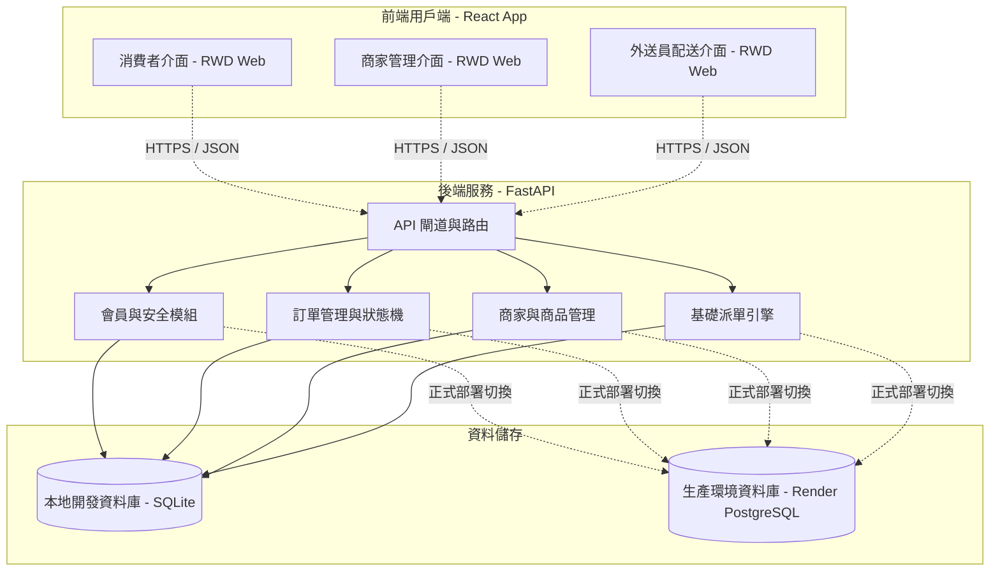

# 外送系統 架構設計文件 (System Architecture Design Document)

- **文件版本**：v1.0.0
- **建立日期**：2026-07-16
- **撰寫人**：AI 架構設計小助手 (architecture-designer)
- **依據需求版本**：`doc/requirements.md` v1.0.0

---

## 1. 系統架構圖 (System Architecture)
本外送系統採用前後端分離架構，前端為 React 響應式網頁 (RWD Web)，後端為 FastAPI RESTful API。本地端採用 SQLite，Render.com 線上環境採用 PostgreSQL。



---

## 2. 核心模組職責 (Core Modules)

| 模組名稱 | 職責說明 | 主要互動對象 |
| :--- | :--- | :--- |
| **Auth 模組** | 用戶註冊、登入與 Token (JWT) 發放與驗證，區分消費者、商家與外送員角色權限。 | 全系統 API |
| **Menu 模組** | 商家資訊設定、商品（菜單）的上架、修改、刪除與上下架狀態控制。 | 商家、消費者 |
| **Order 模組** | 處理消費者購物車結帳、訂單建立、訂單狀態機的更新。 | 消費者、商家、外送員 |
| **Dispatch 模組**| 提供訂單大廳列表、外送員搶單/接單功能、以及後台手動指派外送員的 API 接口。| 外送員、平台管理員 |

---

## 3. 資料流 (Data Flows)

### 3.1 端到端核心業務流程 (End-to-End Delivery Flow)
本流程圖展示從消費者下單、商家製作、外送員搶單配送至收款送達的完整歷程。

```mermaid
sequenceDiagram
    autonumber
    actor C as 消費者
    actor M as 合作商家
    actor R as 外送員
    participant S as FastAPI 後端
    database DB as 資料庫

    C->>S: 1. 提交訂單 (商品, 數量, 外送地址, COD)
    S->>DB: 2. 寫入訂單 (狀態: Pending / 等待接單)
    M->>S: 3. 獲取 Pending 訂單清單
    M->>S: 4. 接單並開始製作
    S->>DB: 5. 更新訂單狀態 (Preparing / 製作中)
    M->>S: 6. 餐點製作完成
    S->>DB: 7. 更新訂單狀態 (Ready / 待取餐)
    R->>S: 8. 從訂單大廳瀏覽 Ready 訂單並點擊接單
    S->>DB: 9. 更新訂單狀態 (Delivering / 配送中, 綁定外送員 ID)
    R->>M: 10. 到店取餐並告知訂單編號
    R->>C: 11. 前往外送地址送餐，並收取現金 (貨到付款)
    R->>S: 12. 確認送達並結案
    S->>DB: 13. 更新訂單狀態 (Delivered / 已送達)
```

---

## 4. 資料庫設計建議 (Database Design)

### 4.1 實體關係圖 (ER Diagram)
本系統的核心關聯式資料表設計如下：

```mermaid
erDiagram
    USERS ||--o{ RESTAURANTS : manages
    USERS ||--o{ ORDERS : places
    USERS ||--o{ ORDERS : delivers
    RESTAURANTS ||--o{ PRODUCTS : offers
    RESTAURANTS ||--o{ ORDERS : receives
    ORDERS ||--o{ ORDER_ITEMS : contains
    PRODUCTS ||--o{ ORDER_ITEMS : detailed_by

    USERS {
        int id PK
        string email UNIQUE
        string password_hash
        string role "customer / merchant / rider"
        timestamp created_at
    }
    RESTAURANTS {
        int id PK
        int user_id FK "關聯商家帳號"
        string name
        string address
        string description
        timestamp created_at
    }
    PRODUCTS {
        int id PK
        int restaurant_id FK
        string name
        int price
        string description
        boolean is_available
        timestamp created_at
    }
    ORDERS {
        int id PK
        int customer_id FK "消費者"
        int restaurant_id FK "商家"
        int rider_id FK "外送員 (可空)"
        string address "外送地址"
        int delivery_fee "外送費 (固定 39 元)"
        int total_amount "總計金額 (商品小計 + 外送費)"
        string status "pending / preparing / ready / delivering / delivered"
        timestamp created_at
        timestamp updated_at
    }
    ORDER_ITEMS {
        int id PK
        int order_id FK
        int product_id FK
        int quantity
        int price_at_order "當下訂購單價"
    }
```

---

## 5. API 設計建議 (API Design)

### 5.1 用戶與認證 API (Auth)
- **用戶註冊**：`POST /api/v1/auth/register`
  - Body: `{ "email": "test@test.com", "password": "securepassword", "role": "customer" }` (role 限制為 'customer', 'merchant', 'rider')
- **用戶登入**：`POST /api/v1/auth/login`
  - Body: `{ "email": "test@test.com", "password": "securepassword" }`
  - Response: `{ "access_token": "JWT_TOKEN", "token_type": "bearer", "role": "customer" }`

### 5.2 消費者端 API (Consumer)
- **取得商家列表**：`GET /api/v1/consumer/restaurants`
- **取得商家選單**：`GET /api/v1/consumer/restaurants/{id}/menu`
- **提交訂單**：`POST /api/v1/consumer/orders`
  - Header: `Authorization: Bearer <Token>`
  - Body: `{ "restaurant_id": 1, "address": "台北市信義區信義路五段7號", "items": [{ "product_id": 3, "quantity": 2 }] }`
- **追蹤訂單狀態**：`GET /api/v1/consumer/orders/{id}`

### 5.3 商家端 API (Merchant)
- **管理商品列表**：`GET /api/v1/merchant/products` / `POST` / `PUT /products/{id}` / `DELETE /products/{id}`
- **取得店內訂單**：`GET /api/v1/merchant/orders`
- **接單 (開始製作)**：`POST /api/v1/merchant/orders/{id}/prepare`
- **完成製作 (等待取餐)**：`POST /api/v1/merchant/orders/{id}/ready`

### 5.4 外送員端 API (Rider)
- **瀏覽大廳待接訂單**：`GET /api/v1/rider/pool` (篩選狀態為 `ready` 且無人接單的訂單)
- **搶單/接受配送**：`POST /api/v1/rider/orders/{id}/accept`
- **確認已送達**：`POST /api/v1/rider/orders/{id}/deliver`

---

## 6. 技術選型 (Technology Stack)
- **前端 (Frontend)**：React.js
  - 使用 React Hooks 管理狀態，CSS-in-JS 或 Vanilla CSS 快速刻畫行動裝置優先 (Mobile-First) 的卡片設計。
- **後端 (Backend)**：FastAPI (Python 3.10+)
  - 高性能非同步 RESTful API，自動產生 Swagger/OpenAPI 文件。
- **資料庫 (Database)**：
  - 本地開發：SQLite (檔案儲存，方便當天快速開發測試)。
  - 正式部署：PostgreSQL (Render.com 提供之免費 PostgreSQL 資料庫)。
- **部署環境 (Deployment)**：Render.com (託管 FastAPI 與 PostgreSQL 服務，前端 React 靜態檔案亦可於 Render 部署)。

---

## 7. 安全性設計 (Security Design)
- **身分驗證**：後端採用 JWT (JSON Web Token) 加密簽章，所有敏感 API 均需驗證 Token。
- **密碼防護**：使用者密碼在註冊時經由 `passlib` 與 `bcrypt` 加密儲存，資料庫中不留存明文密碼。
- **敏感資訊分離**：
  - 開發與正式環境所有金鑰（如 JWT_SECRET）、資料庫 URL 均透過系統環境變數讀取。
  - 禁止將 `.env` 檔案提交至 Git。

---

## 8. 部署方式 (Deployment Strategy)
- **後端部署**：以 Web Service 形式託管於 Render.com，啟動指令 `uvicorn app.main:app --host 0.0.50 --port 10000` (依照 Render 設定環境變數)。
- **前端部署**：以 Static Site 形式部署於 Render.com。
- **資料庫遷移**：使用簡單的 SQLAlchemy `Base.metadata.create_all(bind=engine)` 於啟動時自動在 PostgreSQL 初始化 Tables，縮短部署配置時間。

---

## 9. 已確認之業務設計 (Confirmed Business & Design Rules)
- **外送費與服務費**：預設外送費為固定 39 元，無最低起送金額門檻（起送價）。
- **搶單衝突與併發處理**：當多個外送員同時點擊接同一張單時，利用資料庫交易鎖（Transaction Lock）或唯一索引（Unique Constraint）限制，僅首位接單成功，其餘人回傳 `409 Conflict`（接單失敗）。
- **訂單取消權限**：本期 MVP 不設計訂單取消 API，一旦消費者送出訂單，即無法手動取消，必須循流程流轉至完成。

---

## 10. 待確認事項 (Items to be Confirmed)
> [!NOTE]
> 目前暫無未確認的架構設計事項。所有核心規劃皆已由使用者確認，並納入此設計文件中。

